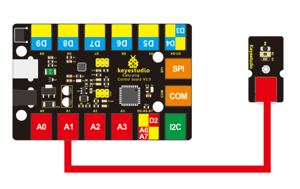
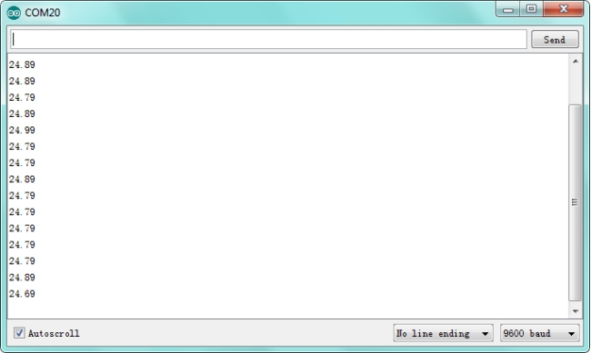

# KS0104 keyestudio EASY plug Analog Temperature Sensor


## 1. Introduction

Are you still looking for a low-cost thermometer? Did you get one? Aha! Here it is! This EASY Plug analog temperature sensor is based on a thermistor. The resistance varies with surrounding temperature change.

It can measure temperature change in the surroundings and send the data to Arduino analog IO. Just need to convert the output data to degrees Celsius temperature by simple programming.

The sensor is convenient and cost effective, widely applied to gardening, home alarm system and other devices.  

This module should be used together with EASY plug control board.

**Special Note:**

The sensor/module is equipped with the RJ11 6P6C interface, compatible with our keyestudio EASY plug Control Board with RJ11 6P6C interface.

If you have the control board of other brands, it is also equipped with the RJ11 6P6C interface but has different internal line sequence, can’t be used compatibly with our sensor/module.

## 2. Specification

- Sensor type: Analog
- Working voltage: 5V
- Temperature range: -55℃～315℃
- High quality connector

## 3. Technical Details

- Dimensions: 38mm * 20mm * 18mm
- Weight: 4.2g

## 4. Connect It Up

Connect the EASY Plug analog temperature sensor to control board using an RJ11 cable. Then connect the control board to your PC with a USB cable.



## 5. Sample Code

Download code: [Code](./Code.7z)

code 1

```c
void setup()
{
	Serial.begin(9600);
}

// the loop routine runs over and over again forever:
void loop()
{
    int sensorValue = analogRead(A1);
    Serial.println(sensorValue);
    delay(1);
}
```

We can see that the analog value is changing according to the surrounding temperature change. But it’s not very obvious.

Let’s solve this by using the following equation.

The value read from the serial port has little difference to normal temperature. eg. The temperature right now is about 25℃.

code 2 

```c
#include <math.h>

void setup()
{
   Serial.begin(9600);
}

void loop()
{
   double val=analogRead(1);
   double fenya=(val/1023)*5;
   // Ohm’s law r/100=fenya/(3.3-fenya)
   double r=(5-fenya)/fenya*4700;// divider resistance 4.7K，4.7K resistor to ground
   //double r=fenya/(5-fenya)*10000;//divider resistance10K，thermistor to ground
   Serial.println( 1/(  log(r/10000) /3950 + 1/(25+273.15))-273.15);//3950 is the      value B of thermistor
   delay(1000);
}
```

## 6. Result

Done uploading the code, open the serial monitor and set the baud rate to 9600, the temperature value will display on the Arduino’s serial monitor.



